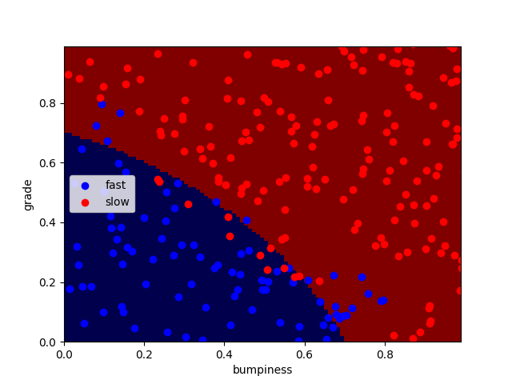

## 朴素贝叶斯分类器

### 1. 学习笔记
1. class_vis.py +30:`np.meshgrid(x[,y,z,...])`：生成网格数据。**二维上反悔的是len(y)行的x，len(x)列的x。
2. class_vis.py +31 :`numpy.ravel() / numpy.flatten()`:将多维数组降位一维；前者是引用，后者是拷贝。
3. class_vis.py 37：`plt.pcolormesh(X, Y, C, **kwargs) `
    > 例如有样本点（X[i，j] , Y[i，j]），对样本周围（包括样本所在坐标）的四个坐标点进行着色，C代表着色方案，kwargs里可以设置着色配置。

    ```
    (X[i,   j],   Y[i,   j]),
    (X[i,   j+1], Y[i,   j+1]),
    (X[i+1, j],   Y[i+1, j]),
    (X[i+1, j+1], Y[i+1, j+1]).
    ```
4. `np.r_()`:
    > np.r_按row来组合array， np.c_按colunm来组合array
    
    ```python
    >>> a = np.array([1,2,3])
    >>> b = np.array([5,2,5])
    >>> //测试 np.r_
    >>> np.r_[a,b]
    array([1, 2, 3, 5, 2, 5])
    >>> 
    >>> //测试 np.c_
    >>> np.c_[a,b]
    array([[1, 5],
        [2, 2],
        [3, 5]])
    >>> np.c_[a,[0,0,0],b]
    array([[1, 0, 5],
        [2, 0, 2],
        [3, 0, 5]])
    ```
5. 准确率：`accuracy_score(y_pre,y_true)`:
    ```python
    from sklearn.metrics import accuracy_score
    ```

### 2. 结果展示


### 3. 部分代码
***
```python
# File: classify_NB.py
from sklearn.naive_bayes import GaussianNB
import numpy as np
def classify(features_train, labels_train):
    ### your code goes here!
    clf = GaussianNB()
    clf.fit(np.array(features_train),np.array(labels_train))
    return clf
```
